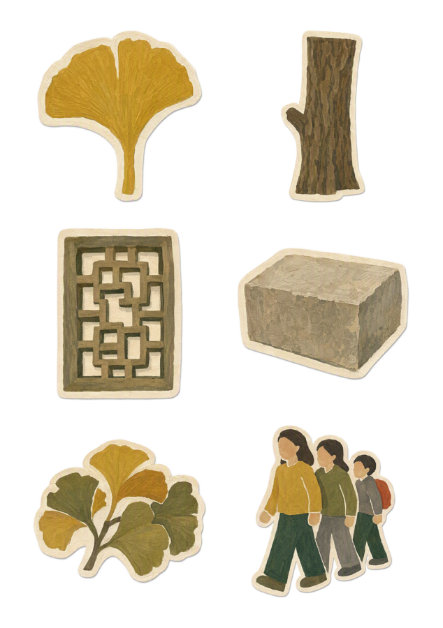
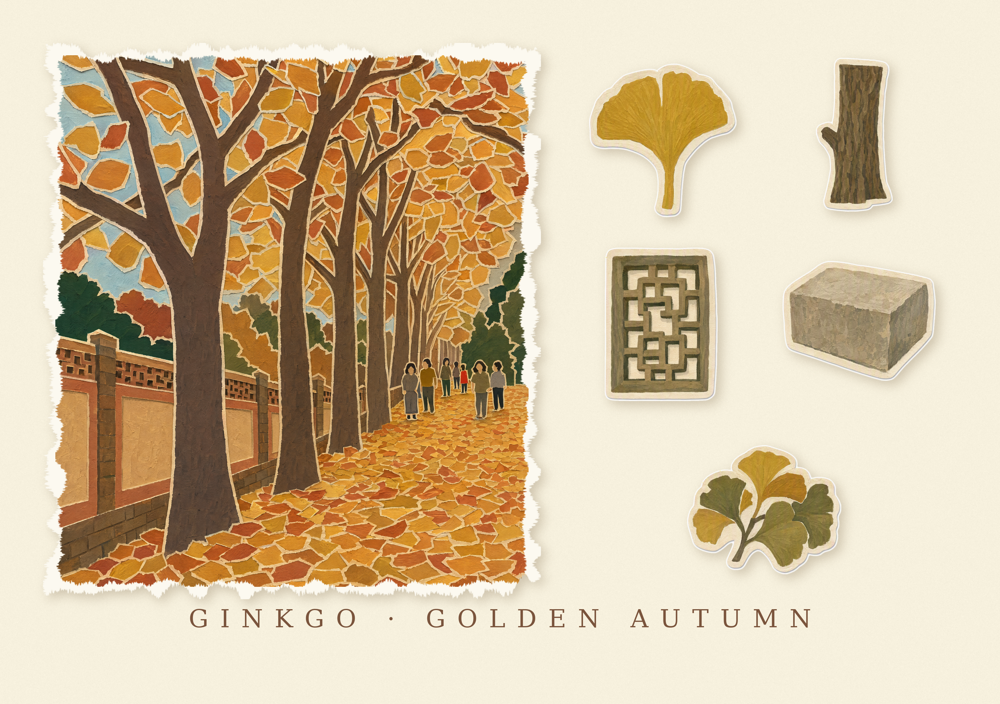

# memory-sticker-studio

把一张现场照片，变成能直接送厂印刷模切的 A5 手账贴纸版。

<p align="center">
  
  
</p>

输入：一张手机照片。
输出：6 枚水粉剪纸拼贴风贴纸元素，排成 A5 版面，400dpi（生图模型像素能力不足时**显式降级到 300dpi 并在交付说明里标注**），带 `CutContour` 刀线图层，PDF / SVG / 单枚透明 PNG 一起给到数码模切店。

> 原来的首图（含现代体育场馆建筑本体）已按 2026-09-01 收紧后的 IP 策略下架：
> 现代地标建筑属受著作权保护的建筑作品，产线已不再画建筑本体，示例图自然也不该再放。

---

## 这套 skill 是怎么写的

核心判断：**AI 出图不是难点，"出的图能不能印"才是难点。**

所以这套东西不是一个 prompt，而是一条有门禁、有质检、有定向重试的产线。整体分两层：

```
memory-sticker-forge   ← 决定"画什么、怎么画"（内容层）
print-ready-doctor     ← 决定"能不能印、怎么切"（工艺层）
```

产线跑起来是 5 步，每步都可以把稿子打回去：

```
G0 照片体检  →  选品  →  出图  →  程序化重排  →  双重质检
   ↓拒稿        ↓去重      ↓          ↓硬保证边距     ↓不合格带着具体意见回到出图
```

### 六个关键设计

**① G0 前置门禁：先决定"这单接不接"**

出图很贵，所以在花掉第一分钱之前先体检。视觉模型读一遍照片，返回结构化 JSON：场景、光线（day/night，决定用哪套色板）、人数、是否疑似未成年人、第三方 IP 清单、可独立成贴的物品、纤细结构。

短边低于 1500px 警告，低于 600px 直接拒稿——不是怕分辨率不够，是**细节不足以从画面里拆出可辨识的独立物件**。

**② 选品不是取前 N 个**

这是踩得最惨的坑。早期代码是 `picked = objs[:5]`，看着没问题，实际三个致命缺陷：

- 生日照片里 `candle` 在清单第 7 位，被截断了 → **蜡烛从来没进过 prompt**
- `cheesecake` 和 `plate` 同时入选，蛋糕本来就盛在盘子上 → 蛋糕贴纸自带盘子，再加一枚单独的盘子，重叠
- `electric guitar` 和 `bass guitar` 同时入选 → 扁平剪纸下轮廓几乎一样，看起来就是两把吉他

现在改成 `select_objects()` 四级过滤：**容器剔除 → 同族折叠 → 纪念物置顶 → 分层兜底**。

同族判定用**中心词**而不是子串匹配。子串匹配会把 `microphone` 判成 phone 族、`guitar amplifier` 判成 guitar 族、`bass drum` 判成 guitar 族，把候选砍光。英文复合名词的中心词在最后：`electric guitar`→guitar，`bass drum`→drum。

**③ 排版交给代码，不交给模型**

模型排不出合格版面。让它排，间距永远不达标。

所以 prompt 里只要求"大量留白、互不接触"，拿到图后由 `relayout.py` 做连通域分割 + 网格重排，**用代码硬保证** 8mm 邻距、10mm 四边留白、400dpi 物理尺寸。这一步不依赖模型的服从性。

**④ 双重质检：量化 + 目视，缺一不可**

- 量化（`print_ready_doctor.py`）：查 dpi、元素数、刀线数、最小邻距、最细笔画宽度
- 目视（视觉模型）：查量化查不出来的——人物有没有画上五官、物品有没有被替换掉、有没有两枚重复、有没有把托盘一起画进去

关键是**质检结论要能变成下一轮的修改意见**。不合格时不是简单重试（那是赌运气），而是把具体问题拼成 `CORRECTIONS` 段追加进 prompt 定向重出。默认最多 4 轮。

**⑤ 纪念物白名单：对抗"加粗规则"的副作用**

模切切不了细线，所以 prompt 里有条硬规则：太细的东西要加粗。但这条规则有副作用——模型会顺手把细的东西**删掉**。

生日照的仙女棒就是这么消失的：它被归进了 `thin_parts`，而规则说 thin_parts 可以省略。

所以加了两道保险：G0 单独标注 `keepsake_objects`（蜡烛、烟花、气球这类"就是为它下单"的东西），prompt 里用独立段落声明这些**必须保留、要放大加粗而不是删掉**；同时代码检查——凡是同时出现在物品清单里的，一律从 thin_parts 里剔除。

**⑥ 版权与合规前置**

G0 就把品牌 logo、赞助商字样、大屏画面、海报图案、动漫形象全部列出来，在 prompt 里点名要求替换成纯色块，质检再复查一遍有没有可读文字。实测能干净去掉 Fender / Orange / Dixon 的 logo 和图库水印。

疑似未成年人会单独告警，需要监护人授权才能接单。

### 为什么人物是"无脸拼贴"而不是剪影

早期用单色深色剪影，用户反馈"人物是棕色的，皮肤和衣服颜色都没有，不好看"。

现在默认 `collage`：人物由多块平涂色纸拼成，**保留头发色、肤色、上衣和下装的颜色分块，但完全没有五官**。既避免了肖像风险，也不再是一坨黑影。`silhouette` 保留为可选档。

---

## 一单要印的是两件东西

这一点决定了整个仓库的结构，先说清楚：

| 产物 | 印在什么上 | 用途 | 谁生成 |
|---|---|---|---|
| **A5 贴纸版** | 不干胶 + 模切 | 撕下来贴手账，是耗材 | `forge.py` |
| **卡纸打印图** | 厚卡纸整张打印 | 收藏 / 摆台 / 送人，是留念品 | `forge_scene.py` + `make_memory_card.py` |

卡纸打印图长这样：左边一整幅主视觉场景，右边几枚贴纸样，底下一行英文小标题。

**为什么卡纸图不让模型一次画完整张？** 早期版本试过，三个问题都是硬伤：

1. 标题是模型「画」出来的字母，几乎必然拼错或糊掉，而且改不了；
2. 卡上的贴纸和真正模切的那六枚不是同一批图案 —— 客户会发现「卡上的蛋糕和我贴纸里的蛋糕不一样」；
3. 出血、页边距、成品尺寸全靠运气，印厂那关过不了。

现在的做法：**卡上的贴纸就是从 A5 成品图里抠出来的那六枚本体**，标题用真字体排，
尺寸/出血/dpi 由代码算死。模型只负责画左边那幅场景，而且场景和贴纸共用同一套色板段，
拼到一张卡上不会一半暖棕一半灰绿。

---

## 快速开始

```bash
pip install -r print-ready-doctor/requirements.txt

# 单张照片 → A5 贴纸版
cd memory-sticker-forge
python3 forge.py /path/to/photo.jpg --outdir out/order1

# 只做体检，不出图（不花钱）
python3 forge.py /path/to/photo.jpg --preflight-only

# 凑满 4 单拼 A3（一张 A3 = 4 张 A5，印厂更便宜）
python3 ../print-ready-doctor/impose_a3.py 单1/FINAL.png 单2/FINAL.png 单3/FINAL.png 单4/FINAL.png --outdir a3_out/

# 卡纸打印图（两步：先出场景，再排版）
python3 memory-sticker-forge/forge_scene.py 照片.jpg \
        --preflight run/p1/preflight.json --outdir run/p1
python3 print-ready-doctor/make_memory_card.py \
        --scene run/p1/scene.png --stickers run/p1/FINAL.png \
        --caption "CANDLELIGHT · WISH · SPARKLER" --outdir 交付/01

# 不确定哪几枚上卡？先出带编号的预览，再用 --drop 排除人物那枚
python3 print-ready-doctor/make_memory_card.py --scene ... --stickers ... \
        --outdir 交付/01 --preview-only

# 导出数码模切店能直接收的文件
python3 ../print-ready-doctor/export_for_digital_cut.py out/order1/FINAL.png --outdir 交付/
```

### 常用参数

| 参数 | 默认 | 说明 |
|---|---|---|
| `--elements` | 6 | 每版枚数（5 物品 + 1 人物） |
| `--max-rounds` | 4 | 质检不合格时最多重出几轮 |
| `--figure-style` | collage | `collage` 无脸拼贴 / `silhouette` 单色剪影 |
| `--gap` / `--margin` | 8 / 10 mm | 元素最小净距 / 四边留白 |
| `--dpi` | 400 | 成品分辨率 |
| `--objects` | 自动 | 手动指定物品清单，用 `;` 分隔 |
| `--exclude` | 无 | 跨单去重：已在其它版画过的物品 |

## 换生图后端

所有 AI 调用都收在 `providers.py` 一个文件里，主流程不直接依赖任何平台：

```python
generate_image(photo_path, prompt, out_png)   # 图生图
analyze_images(paths, task)                   # 视觉理解
```

支持 `openai`（默认 `gpt-image-2`）、`volcengine`（火山方舟）、`cmd`（任意外部命令）。生图和视觉可以分别配置：

```bash
export FORGE_PROVIDER=openai
export OPENAI_API_KEY=sk-xxx
export OPENAI_IMAGE_SIZE=a5-300     # 1760x2480；a5-400 = 2336x3312

# 换后端前先自检。这两个入口都【不消耗生图额度】
python3 memory-sticker-forge/providers.py --capabilities   # 像素能力 vs 400/300dpi 需求与余量表
python3 memory-sticker-forge/providers.py --selftest       # key 格式 / 连通性 / 模型 ID / 请求体校验
# 想连带实测视觉与生图（会花钱）：
python3 memory-sticker-forge/tools/selftest_provider.py --all 你的照片.jpg
```

`forge.py` 正式跑图前会自动跑一次自检（fail-fast），不通过直接退出，不会跑到一半才 404；`--skip-selftest` 可关。

**provider 实测状态（如实标注，别猜）**

| provider | 400dpi | 实测状态 |
|---|---|---|
| `openai` gpt-image-2 | ✅ 能力可达（需 `OPENAI_IMAGE_SIZE=a5-400`） | ⚠️ **从未真实调用过**（无 key） |
| `volcengine` Seedream 4.0 | ❌ 总像素上限约 462 万，A5@400dpi 需 771 万 → 只能 300dpi | ⚠️ **从未真实调用过**；模型 ID 带日期后缀（如 `-250828`），报 `model not found` 时先去控制台抄最新 ID |
| `gemini` 2.5 Flash Image | ❌ 分辨率不达标 | 仅建议用于视觉理解 |
| `cmd` | 未知（能力无从登记） | 取决于你自己接的命令；真实分辨率由输出端门禁校验 |

> `gpt-image-2` 要求宽高是 16 的倍数、总像素 ≤8.29M。`a5-300` 档短边 1760px，输出门禁是 1739px（= 300dpi 理论值 1748px × (1−0.5% 量化容差)），余量 21px；改尺寸时留意。
> 达不到 400dpi 时产线**显式降级到 300dpi 并在日志、质检报告、模切店须知里标注**，不会静默插值成假 400dpi。

## 关键规格（改动前请先读）

| 项 | 值 | 为什么 |
|---|---|---|
| 成品 | A5 148×210mm | 4 张拼 A3，印厂标准 |
| 分辨率 | 400dpi = 2331×3307px | 由 `px_at(mm,dpi)=round(mm÷25.4×dpi)` 推导，不写魔数；达不到就显式降级到 300dpi 并标注 |
| 生图最小短边 | 1739px | = 300dpi 理论值 1748px × (1−0.5% 量化容差)，低于此直接报错 |
| 单枚尺寸 | 22~62mm | 手账贴纸合理区间 |
| 元素最小净距 | 8mm | 模切安全 |
| 刀线 | 图层 `CutContour`，#FF00FF，0.25pt | 只切不印 |
| 切割 | 半切 kiss cut | 底纸不断，可逐枚撕取 |

## 已知限制

- 输出是 **RGB 而非 CMYK**（不嵌输出 ICC），请按 sRGB 解释、在 RIP 端转换，**首单必须打样确认色差**。我们没有做过实物色卡比对
- 两个外部生图 provider（`openai` / `volcengine`）**代码完成但从未真实调用过**，见上方实测状态表
- `SIMILAR_FAMILIES` / `COMPOSITE_REPLACE` 仍是硬编码词库，遇到新品类（乐高、盲盒、玩偶、手办）会漏判；兜底是「模型判断 + 通用中心词规则 + 不可收敛就换元素」，所以新品类表现为多花 1~2 轮，不会 4 轮全败
- **IP 合规**：卡通吉祥物 / 玩偶手办盲盒 / 主题乐园元素 / 文创设计 / 商标字标一律不画；**现代地标建筑本体（体育场馆、摩天楼、观光塔）属受著作权保护的建筑作品，也不画**；古建筑本体（城墙、古塔、飞檐、石狮）与自然景观可画，优先画「那天你带着的东西」（门票、地图、水壶、背包、帽子、食物、落叶）
- 照片可提取物品少于 6 个时，兜底会允许轻微同族重复（缺枚数比雷同更糟）
- 单张 A5 内不做跨单去重，多单请用 `--exclude` 手动传

## 目录

```
memory-sticker-forge/
  forge.py                     主产线
  providers.py                 AI 能力适配层（换后端只改这里）
  tools/selftest_provider.py   provider 三级自检
print-ready-doctor/
  print_ready_doctor.py        量化质检 + 刀线生成
  relayout.py                  程序化 A5 重排
  impose_a3.py                 A3 四宫格拼版
  embed_svg.py                 位图内嵌进 SVG（防单独发厂丢图）
  export_for_digital_cut.py    数码模切导出
CONTEXT.md                     项目上下文（新接手先读这个）
CHANGELOG.md                   变更日志，含每个坑的根因
```
